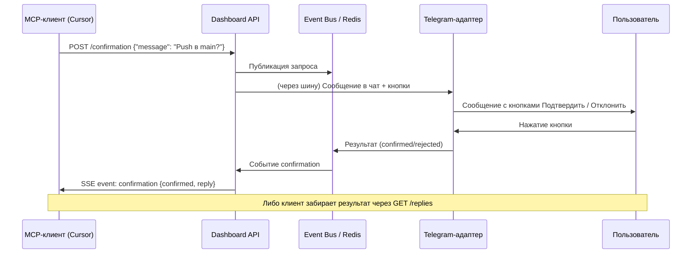

# MCP для агента (HTTP/SSE)

Доступ агента (Cursor и др.) к уведомлениям в Telegram и запросам подтверждения реализован через **HTTP API и SSE**, а не stdio. URL и секрет создаются в дашборде.

## Настройка

1. Запустите дашборд, Redis, Telegram-адаптер.
2. В дашборде откройте **MCP (агент)**.
3. Нажмите **Создать endpoint**: укажите имя (например, Cursor) и **Telegram Chat ID** (для личного чата = User ID).
4. После создания сохраните **URL** и **секрет** — секрет показывается один раз. При необходимости создайте новый секрет кнопкой **Новый секрет**.

## URL и авторизация

- **URL** имеет вид: `https://<хост>/mcp/v1/agent/<endpoint_id>`.
- **Секрет** передаётся в заголовке: `Authorization: Bearer <секрет>`.
- В MCP config на стороне потребителя укажите этот URL и секрет в `args` (или в заголовках, в зависимости от клиента).

## API (все запросы с заголовком Authorization: Bearer &lt;секрет&gt;)

| Метод | Путь | Описание |
|-------|------|----------|
| POST | `/mcp/v1/agent/<id>/notify` | Тело: `{"message": "..."}`. Отправить сообщение в Telegram. |
| POST | `/mcp/v1/agent/<id>/question` | Тело: `{"message": "..."}`. Отправить вопрос пользователю (подсказка ответить confirm/reject или текстом). |
| POST | `/mcp/v1/agent/<id>/confirmation` | Тело: `{"message": "..."}`. Запросить подтверждение: отправить в Telegram, поставить ожидание ответа. Результат приходит по SSE или при следующем ответе пользователя. |
| GET | `/mcp/v1/agent/<id>/replies` | Забрать и очистить очередь обратной связи (сообщения из `/dev ...`). Ответ: `{"ok": true, "replies": ["...", ...]}`. |
| GET | `/mcp/v1/agent/<id>/events` | **SSE** (Server-Sent Events). Долгое соединение: события `confirmation` (результат подтверждения) и `feedback` (новое сообщение от пользователя). Данные в формате JSON в поле `data`. |

## Инструменты MCP (JSON-RPC tools/list и tools/call)

При подключении через JSON-RPC (POST `/mcp/v1/agent/<id>` с методом `tools/list`) доступны инструменты:

| Инструмент | Описание | Аргументы |
|------------|----------|-----------|
| **notify** | Отправить сообщение в Telegram | `message` (строка) |
| **ask_confirmation** | Запросить подтверждение (кнопки Подтвердить/Отклонить) | `message`, опционально `timeout_sec` (по умолчанию 120) |
| **get_user_feedback** | Забрать сообщения пользователя (из `/dev ...`) | — |
| **create_task** | Создать задачу пользователя (user_id = chat_id endpoint'а). Можно передать `title` или `text`/`phrase` (например «завтра купить молоко» — парсер подставит срок). | `title`, или `text`, или `phrase` |
| **list_tasks** | Список задач пользователя | — |
| **sync_task_to_todo** | Создать задачу в Microsoft To-Do (если в дашборде настроена интеграция). | `title` или `text`, опционально `list_id` |
| **add_calendar_event** | Добавить событие в Google Calendar (при наличии интеграции). Пока возвращает подсказку по настройке. | `title` (обяз.), `start_iso`, `end_iso`, `description` |

Пример вызова через JSON-RPC: `{"jsonrpc":"2.0","id":1,"method":"tools/call","params":{"name":"create_task","arguments":{"text":"завтра купить молоко"}}}`.

## SSE

Подключитесь к `GET /mcp/v1/agent/<id>/events` с заголовком `Authorization: Bearer <секрет>`. События:

- **event: confirmation** — пользователь ответил на запрос подтверждения: `data: {"confirmed": true/false, "rejected": ..., "reply": "..."}`.
- **event: feedback** — пользователь отправил сообщение через `/dev текст`: `data: {"text": "..."}`.

Сервер периодически шлёт `: keepalive` для сохранения соединения.

## Сценарии использования (Cursor и др.)

- **Уведомления:** `notify` — отправить в Telegram результат работы, ссылку, предупреждение.
- **Подтверждение перед действием:** `ask_confirmation` — push, deploy, опасные команды; дождаться ответа по SSE или через `/replies`.
- **Задачи пользователя:** `create_task` (текст или «завтра купить молоко»), `list_tasks` — список; задачи хранятся в Redis по user_id (chat_id endpoint'а).
- **Microsoft To-Do:** `sync_task_to_todo` — при настроенной интеграции (дашборд → Интеграции) создать задачу в To-Do.
- **Календарь:** `add_calendar_event` — при появлении интеграции Google Calendar создание события; пока возвращается подсказка по настройке.

Подключение: в настройках MCP клиента укажите URL дашборда и секрет endpoint'а (дашборд → MCP (агент) → Создать endpoint).

## Поток запроса подтверждения



## Уведомления не приходят?

Цепочка: MCP/API → Redis (канал `assistant:outgoing_reply`) → Telegram-адаптер → sendMessage. Если сообщения не доходят:

1. **Задайте Chat ID для MCP:** в дашборде откройте **Каналы → Telegram**, в поле «Chat ID для MCP/агента» укажите ваш Telegram Chat ID (для личного чата он совпадает с User ID). Либо добавьте пользователя в «Разрешённые User ID» — тогда будет использован первый из списка.
2. Убедитесь, что **Telegram-адаптер** запущен и подписан на Redis (в логах при старте должно быть сообщение о подписке на исходящие).
3. При вызове notify без заданного Chat ID в логах core/MCP появится предупреждение: «Задайте TELEGRAM_DEV_CHAT_ID…».

## Поведение в Telegram

- Ответ на запрос подтверждения (следующее сообщение после вопроса): `confirm`/`ok`/`yes`/`да` → подтверждение, `reject`/`no`/`cancel`/`нет`/`отмена` → отмена; иначе текст попадает в `reply`. Сообщение не уходит в диалог с ассистентом.
- **/dev текст** — добавляет текст в очередь; агент забирает через GET `/replies` или получает событие `feedback` по SSE.

## Пример для клиента (curl)

```bash
# Уведомить
curl -X POST "https://your-host/mcp/v1/agent/ENDPOINT_ID/notify" \
  -H "Authorization: Bearer YOUR_SECRET" \
  -H "Content-Type: application/json" \
  -d '{"message": "Начинаю деплой."}'

# Запросить подтверждение (ответ придёт по SSE или в следующем /replies)
curl -X POST "https://your-host/mcp/v1/agent/ENDPOINT_ID/confirmation" \
  -H "Authorization: Bearer YOUR_SECRET" \
  -H "Content-Type: application/json" \
  -d '{"message": "Выполнить push в main?"}'

# Забрать обратную связь
curl "https://your-host/mcp/v1/agent/ENDPOINT_ID/replies" \
  -H "Authorization: Bearer YOUR_SECRET"

# SSE (долгое соединение)
curl -N "https://your-host/mcp/v1/agent/ENDPOINT_ID/events" \
  -H "Authorization: Bearer YOUR_SECRET"
```

## Stdio (опционально)

Для локального использования без HTTP по-прежнему можно запустить stdio-сервер:

```bash
python -m assistant.mcp_server
```

Он использует один «основной» чат из `TELEGRAM_DEV_CHAT_ID` или первый из разрешённых. Для нескольких endpoint'ов и URL/секрета используйте HTTP API и страницу **MCP (агент)** в дашборде.
